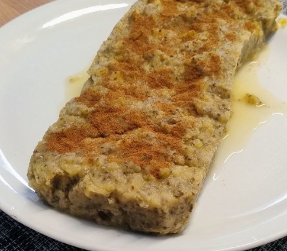

For 4 servings.

1.  **Prepare the Apples:** Wash the **4 apples** well (do not peel them) and cut them into small cubes.
2.  **Cook the Apples:** In a frying pan or pot, melt the **butter** over medium heat. Add the chopped apples and **cinnamon**. Cook, stirring occasionally, until the apples soften and begin to break down, forming a thick compote (about 10-15 minutes). If desired, add the sweetener or sugar at this step.
3.  **Hydrate the Gelatin:** While the apples are cooking, place the **4 gelatin sheets** in a bowl of cold water for about 5 minutes, until they are soft.
4.  **Add Chia and Vanilla:** Remove the pan from the heat. Stir in the **chia seeds** and **vanilla extract**. Stir well to distribute the chia evenly. The residual heat from the compote will help the chia start to gel.
5.  **Dissolve the Gelatin:** Squeeze the excess water from the hydrated gelatin sheets and add them to the hot compote (off the heat). Stir vigorously until they are completely dissolved.
6.  **Assembly and Setting:** Pour the mixture into a small mold (ideally silicone or lined with cling film for easy unmolding). Smooth it with a spoon.
7.  **Chill:** Refrigerate for a minimum of **4 hours** or until the cake has completely set and is firm.

---

_Adaptation from [Cocina Fácil](https://www.lecturas.com/recetas/postre-manzana-sin-horno-2-ingredientes_19649.html)._

