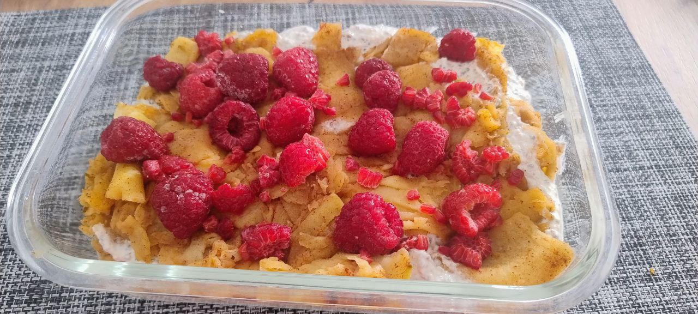

1. Peel and very finely slice the green apples.
2. Sauté them in a pan with the butter, ginger, and cinnamon for 8–10 minutes, stirring occasionally.
3. In a bowl, mix the fresh cheese (quark or similar) with the vanilla extract, ground chia seeds, and rolled oats.
4. In a glass container, alternate layers of warm apple with the cheese mixture.
5. Top with frozen raspberries and serve chilled or slightly warm.

