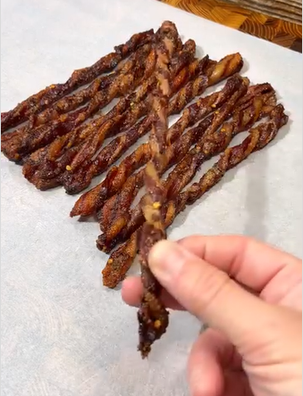

1. **Preheat:** Set your smoker (or oven) to 400°F (approx. 200°C).
2. **Prepare the coating:** In a bowl, mix the brown sugar, crushed red pepper, and black pepper.
3. **Coat and twist:** Coat each slice of bacon thoroughly with the sugar and pepper mixture, then twist the bacon tightly.
4. **Arrange:** Place the twisted bacon on a cooling rack (this allows air to circulate for even cooking).
5. **Cook:** Put the rack into the smoker and cook for about 20 minutes. Keep a close eye on them to ensure they don't char, as times may vary.
6. **Set:** Remove from the heat and let them rest on parchment paper for 15 minutes. This step is crucial to allow the sugar to firm up and the bacon to become crispy.

---

_From [Instagram @cookingintheyard](https://www.instagram.com/reel/C2vY2X7u_u2)._

