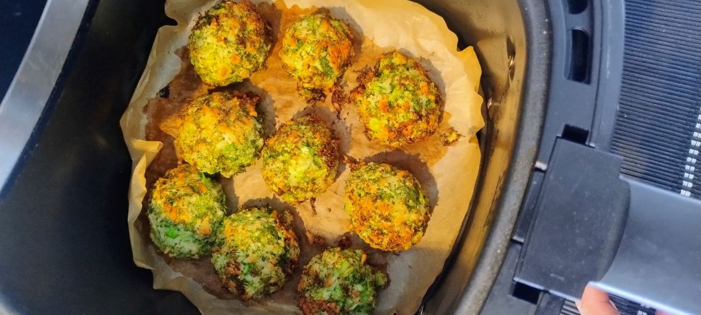

1. **Prepare the broccoli:**  
Finely chop the raw broccoli (florets and stems if desired) using a knife or pulse in a food processor until it resembles coarse crumbs. This method retains all the nutrients and texture of the fresh broccoli.

2. **Mix the ingredients:**  
In a large bowl, combine the chopped broccoli with the grated cheese, breadcrumbs, and eggs. Mix until a uniform dough forms.

3. **Shape the balls:**  
With clean hands, form small, even-sized balls from the mixture. You should get about 12–15 balls depending on their size.

4. **Cook the balls:**  
**Air fryer method:** Place the broccoli balls in the air fryer and cook at 195°C for 12 minutes.  
**Oven method:** Preheat the oven to 200°C and bake the balls for 15 minutes, or until they are golden and lightly crispy.

1. **Serve:**  
Serve warm as a snack, appetizer, or light lunch. They pair well with yogurt dip, hummus, or tomato sauce.

## Notes:
- You can use gluten-free breadcrumbs for a fully gluten-free version.
- Lactose-free cheese like Kaiku works great for intolerant individuals.
- Try adding a pinch of garlic powder or parsley for extra flavor.

---

_From [Instagram @kaikusinlactosa](https://www.instagram.com/p/DG5Wba2ANUM/?utm_source=ig_web_copy_link&igsh=MzRlODBiNWFlZA==)._

