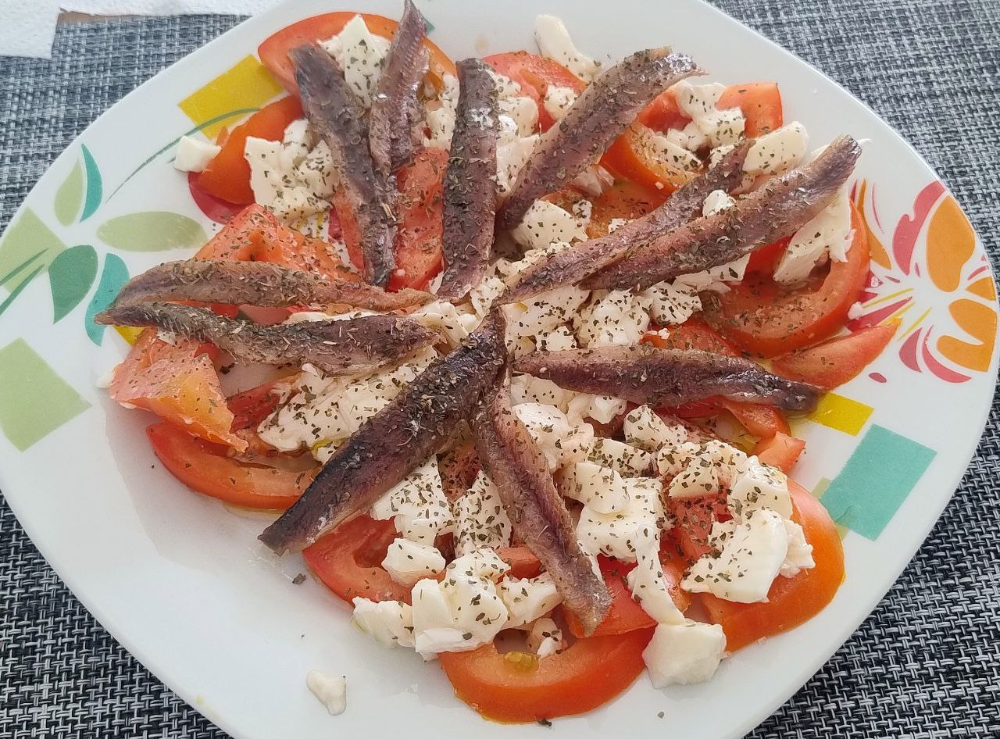

1.  **Prepare the Tomatoes:** Wash the **tomatoes** and slice them into medium-thick rounds. Arrange them decoratively on the base of a large plate or serving platter.

2.  **Add the Burrata:** Gently tear the **burrata** with your hands into irregular pieces, or carefully slice it. Place the burrata pieces over the tomato slices, distributing them evenly.

3.  **Arrange the Anchovies:** Lightly drain the **anchovy fillets** from their oil and distribute them over the burrata and tomatoes. You can arrange them in a radial pattern or simply scatter them.

4.  **Dress:** Generously drizzle the entire salad with **Extra Virgin Olive Oil (EVOO)**. The quality of the oil is key for this dish.

5.  **Season and Garnish:** Sprinkle **flaky sea salt** to taste. Finish by adding the **fresh basil leaves** (whole or gently torn). If desired, and as sometimes seen in the image, sprinkle a little **dried oregano** and/or freshly ground black pepper for an additional aromatic touch.

6.  **Serve:** Serve the salad immediately to enjoy the freshness and contrasting flavors of all the ingredients.

---

