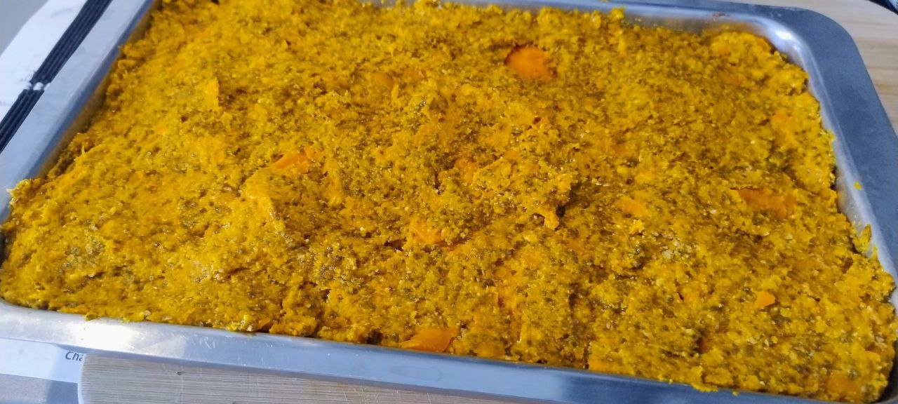

1. Slice the carrots and boil them in a little water for about 15 minutes until soft. Drain well and let them cool.  
2. Crush the cookies into fine crumbs. Mix them with the melted butter and cocoa powder until you get a uniform dough.  
3. Press this mixture firmly into the bottom of a rectangular tray or pan to form the base. Chill in the fridge.  
4. Once the carrots are cold, mash them with a fork or blend them until you get a thick purée.  
5. Add the vanilla extract, chia seeds, and shredded coconut (if using) to the purée. Mix well.  
6. Gradually add oat flour (or sponge cake crumbs) until the mixture is firm and easy to shape.  
7. Spread this mixture over the cookie base, smoothing the surface evenly.  
8. Refrigerate for at least a couple of hours before serving. Optionally, sprinkle shredded coconut or powdered sugar on top for decoration.

---

This recipe is similar to [**Carrot & Coconut balls**]().

