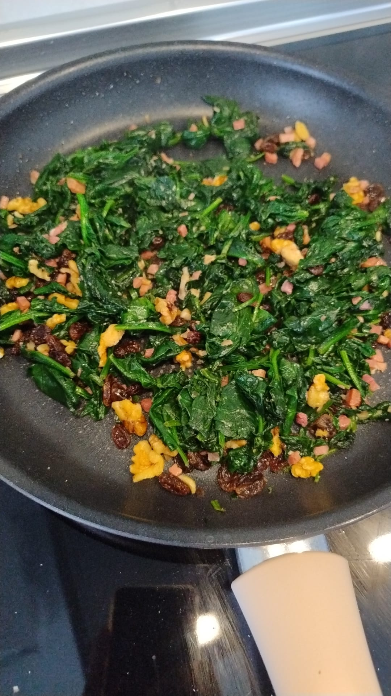

1. **Hydrate the raisins:**
Place the raisins in a bowl with warm water and let them soak for 10-15 minutes. Drain and set aside.

2. **Cook the spinach:**
If using fresh spinach, wash it thoroughly and drain. Bring a large pot of salted water to a boil, add the spinach, and blanch for 1-2 minutes. Drain and cool quickly under cold water.
If using frozen spinach, cook according to the package instructions and drain well.
Toast the pine nuts:
In a dry skillet, toast the pine nuts over medium heat until golden brown. Remove and set aside.

3. **Sauté the garlic:**
In the same skillet, heat the olive oil and lightly sauté the garlic, thinly sliced, until fragrant.

4. **Combine ingredients:**
Add the hydrated raisins and toasted pine nuts to the skillet with the garlic. Stir for 1 minute to combine the flavors.
Add the drained spinach, mix well, and cook for 2-3 minutes over medium heat.

5. **Season to taste:**
Adjust the seasoning with salt and, if desired, a pinch of black pepper.

Serve warm as a side dish for meats, fish, or enjoy it as a main dish with some crusty bread.

## Tips
- For an extra touch, add a splash of sherry vinegar or sprinkle with chopped serrano ham for added flavor.
  
---

