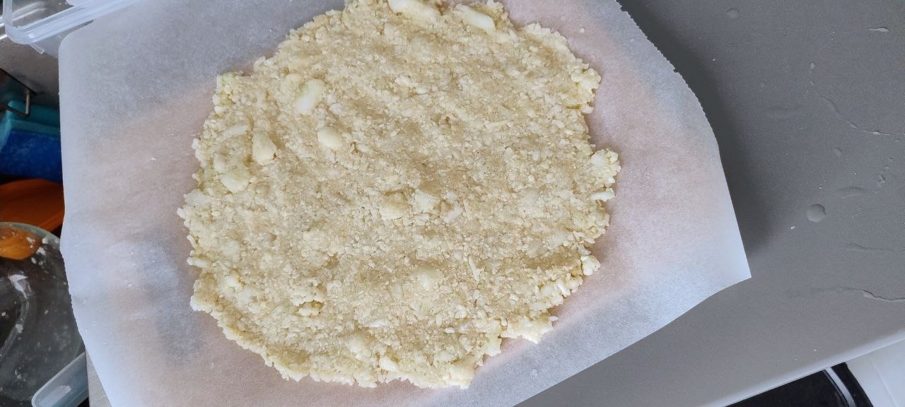

This recipe is similar to [**Broccoli pizza crust**]().

1. **Preheat the oven:**
Set the oven to 220°C (425°F). Line a baking sheet with parchment paper or lightly grease it with oil.

1. **Prepare the cauliflower:**
Pulse the cauliflower in a food processor until finely grated. Transfer the grated cauliflower to a cheesecloth or clean kitchen towel and squeeze out as much water as possible to ensure a dry mixture.

1. **Make the dough:**
In a bowl, mix the grated cauliflower, egg, 2 tbsp mozzarella cheese, Parmesan cheese, Italian seasoning, garlic powder, salt, and pepper. Combine thoroughly until a dough-like consistency forms.

1. **Shape the crust:**
Place the cauliflower mixture onto the prepared baking sheet. Shape it into a round pizza crust about 1.25 cm thick. 

1. **Bake the crust:**
Bake in the preheated oven for 10-12 minutes or until golden brown.

6. **Add toppings:**
Remove the crust from the oven and spread the pizza sauce evenly on top. Sprinkle with the remaining mozzarella cheese, then add your favorite toppings (sliced cherry tomatoes, mushrooms,...).

7. **Finish baking:**
Return the pizza to the oven and bake for another 8-10 minutes, or until the cheese is melted and the edges of the crust are crispy.

8. **Serve:**
Garnish with fresh basil, slice, and enjoy your personal-sized cauliflower pizza!

## Notes:
- Using the stems of cauliflower adds a sustainable twist to this recipe without compromising taste or texture!

---

_Adapted from [Instagram @everythinghealthyfood](https://www.instagram.com/p/B_kntaohcXy/?utm_source=ig_web_copy_link)._

