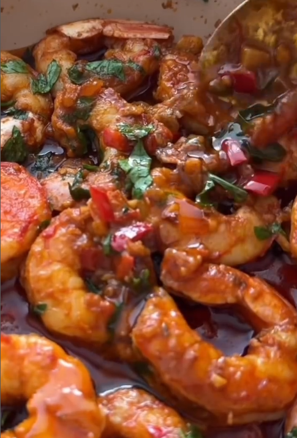

1. **Prepare the shrimp:**  
If not already done, wash, peel, and devein the shrimp.

2. **Cook the aromatics:**  
In a pan over medium heat, add the butter and olive oil. Once hot, add the garlic, diced red onion, and chilli. Sauté for about 2 minutes until fragrant.

3. **Add seasoning and lemon:**  
Stir in the smoked paprika and chilli & lemon seasoning. Cook for another 2 minutes. Add the lemon zest and juice and mix well.

4. **Cook the shrimp:**  
Add the shrimp to the pan and cook for about 2 minutes per side, or until pink and cooked through.

5. **Garnish and serve:**  
Remove from heat, garnish with plenty of chopped fresh parsley, and stir gently. Serve hot with crusty bread, pasta, or rice.

## Notes:
- Adjust the amount of chilli to your spice preference.
- For a dairy-free version, you can use more olive oil instead of butter.
- These shrimp also make a great taco filling!

---

_From [Instagram @thecurrycountess](https://www.instagram.com/reel/DGf7wHPIdmH/?utm_source=ig_web_copy_link&igsh=MWx5cmlxaXc5Z2F3eA==)._

