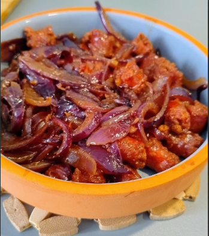

1. **Cook the chistorra:** Heat a large frying pan over medium heat (no oil needed if the chistorra is fatty). Add the chistorra, sliced into smaller pieces (about 5-7 cm long), and cook until browned on all sides. Remove the chistorra from the pan and set it aside. Leave the rendered fat in the pan.
2. **Clean the pan:** Remove any burnt bits (grass) from the pan, leaving behind the flavorful fat. If needed, add a drizzle of olive oil.
3. **Cook the onion:** Add the sliced onion to the pan and sauté over medium heat. Stir frequently until the onion becomes soft and golden, about 8-10 minutes.
4. **Combine and cook:** Return the cooked chistorra to the pan with the onions. Pour the beer into the pan and bring it to a gentle simmer.
5. **Reduce the beer:** Cook everything together until most of the beer has evaporated, leaving a thick, flavorful sauce that coats the chistorra and onions, about 10-15 minutes.
6. **Serve:** Serve the chistorra hot, garnished with fresh parsley if desired. Pair it with crusty bread for dipping.

---

