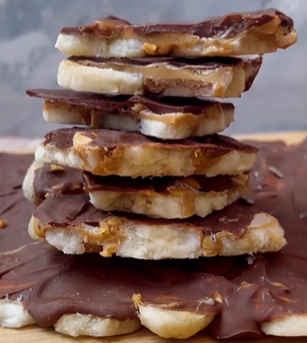

1. Place the banana slices on a board or tray lined with parchment or baking paper.
2. Add the peanut butter, then the nuts (e.g., peanuts, almonds, pistachios,...) on top, and finally the melted chocolate.
3. You can sprinkle some salt or more nuts on top as decoration.
4. Freeze for at least 1 hour.
5. Cut it in pieces.

## Storage
Store in the freezer in an airtight container or plastic bag. It lasts 3 to 4 months!

---

_Adaptation from [Instagram @laverdudegabi](https://www.instagram.com/reel/C4T71UHL9nk/?utm_source=ig_web_copy_link&igsh=MzRlODBiNWFlZA==)._

