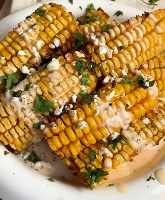

1.  **Prepare the Corn:** Place the **raw corn on the cob** upright on a cutting board. Using a large, sharp knife, cut the corn lengthwise, splitting it into four "ribs." Repeat with all the corn cobs.

2.  **Prepare the Seasoning:** In a large bowl, mix the **melted butter** with the **garlic powder**, **paprika**, **salt**, and **pepper**.

3.  **Coat the Corn Ribs:** Add the corn "ribs" to the bowl and mix them well so they are evenly coated with the butter and spices.

4.  **Cook in the Air Fryer:** Place the **corn ribs** in the air fryer basket, making sure they are not crowded. Cook at **180°C (350°F)** for **15 minutes**, or until they are golden brown, tender, and have curled slightly.

5.  **Prepare the Final Sauce (optional):** While they are cooking, in a small bowl, mix the **artisan mayonnaise** with the **lime juice** and **hot sauce** (if you're using it).

6.  **Serve and Garnish:** Remove the corn ribs from the air fryer. Serve them immediately, drizzling the mayonnaise sauce, **chopped cilantro**, and **crumbled fresh cheese** on top.

---

_Adapted from [Instagram @caligourmet](https://www.instagram.com/reel/DDzgaZypwTH/?utm_source=ig_web_copy_link)._

