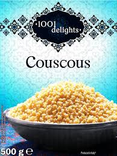

1. **Boil the water:** In a large saucepan, bring the water to a boil with a pinch of salt.

2. **Add the couscous:** Once the water is boiling, remove the saucepan from the heat.

3. **Mix:** Pour in the same amount of couscous (1:1 ratio by volume or weight) and stir carefully with a spoon.

4. **Rest:** Let the couscous soak for approximately 5 minutes off the heat so it absorbs the liquid.

5. **Add fat:** When the water has been completely absorbed, add 2 or 3 pieces of butter (or a splash of olive oil if you prefer the vegan option).

6. **Fluff:** Using a fork, gently stir the couscous to separate the grains and make it fluffy.

7. **Serve:** It is now ready to serve as a side dish or a salad base.

---

