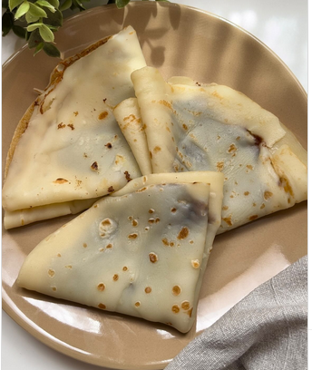

1.  **Prepare the Batter:** In a bowl, beat the **egg** with the **milk or plant-based drink**. Add the **salt** and **sugar** and mix well until combined.

2.  **Add the Flour:** Gradually incorporate the **flour**, whisking as you go. Continue adding flour until the mixture has the consistency of a **thin custard**—that is, it should be fluid enough to spread easily in the pan.

3.  **Rest (optional):** If you have time, let the batter rest in the refrigerator for about 15-20 minutes. This helps the bubbles disappear and makes the batter more elastic.

4.  **Cook the Crepes:** Heat a non-stick pan over medium heat. Grease it with a little **butter or oil**. Pour a small amount of batter, swirling the pan to cover the entire base in a thin layer.

5.  **Flip:** Cook for 1-2 minutes or until the edges are golden. Using a spatula, flip the crepe and cook the other side for 1 more minute.

6.  **Serve:** Repeat the process with the rest of the batter. Serve the crepes warm, filled with your favorite ingredients, whether sweet (jam, Nutella, cream, fruit) or savory (ham, cheese, etc.).

---

_Adapted from [Instagram @sabrina_abate](https://www.instagram.com/reel/C7v8qycoBUp/?utm_source=ig_web_copy_link)._

