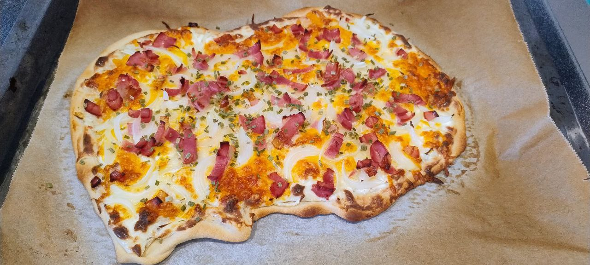

For **1 pizza**.

1.  **Prepare the Dough:** In a bowl, mix the **flour** and **salt**. Make a well in the center and pour in the **warm water** and **olive oil**. Mix until a dough forms.
2.  **Knead and Rest:** Knead on a lightly floured surface for 5-8 minutes until smooth. Cover and let it rest at room temperature for **30 minutes**.
3.  **Prepare the Topping:** Peel the **onion** and slice it **very thinly** (julienne). Cut the **bacon** into small strips or cubes.
4.  **Cream Base:** In a small bowl, mix the **Crème Fraîche** (or Sour Cream) with a pinch of **salt**, **black pepper**, and **nutmeg** (optional).
5.  **Preheat and Roll Out:** Preheat the oven to the highest possible temperature (ideally **250°C** or higher) with the baking tray inside. On parchment paper, roll out the portion until it is **extremely thin**.
6.  **Assemble the Tarte Flambée:** Spread the crème fraîche mixture over the dough base, leaving a small border. Distribute the **onion** and the pieces of **bacon** evenly on top. If you use other cheeses like **mozzarella** or **provolone** (non-traditional), add them now.
7.  **Bake:** Place the Tarte Flambée onto the hot tray in the oven. Bake for **8 to 12 minutes** or until the crust is crispy and the edges are golden brown. Garnish with fresh chives (optional). Serve immediately.

---

_Adapted from [Instagram @sofiatecocinaa](https://www.instagram.com/reel/DOl1LIJDLIl/?utm_source=ig_web_copy_link)._

