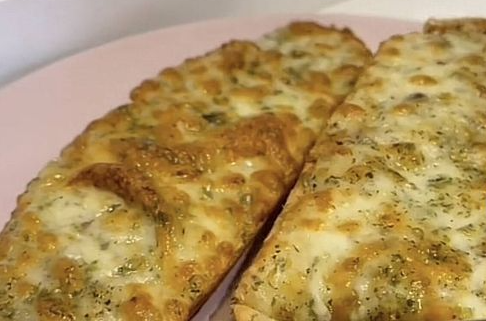

1. **Prepare the garlic butter:** In a small bowl, mix the softened butter with minced garlic, chopped parsley, and a pinch of salt. If desired, add some grated Parmesan for extra flavor.
2. **Slice the bread:** Cut the baguette or loaf into slices, making sure not to cut all the way through so the slices stay connected at the bottom.
3. **Spread the garlic butter:** Using a knife or spoon, spread the garlic butter mixture between each slice and across the top of the bread.
4. **Wrap and bake:** Wrap the bread in aluminum foil (optional) and place it in the preheated oven (or air fryer). Bake at 180°C (350°F) for 15-20 minutes (or 4-5 minutes in the air fryer), or until the bread is warm and crispy.
5. **Optional grilling:** For a crispier finish, unwrap the foil and grill the bread for an additional 2-3 minutes
6. **Serve:** Remove from the oven and serve hot.

---

_Adaptation from [Alimente](https://www.alimente.elconfidencial.com/recetas/2024-09-13/prepara-receta-pan-de-ajo-freidora-de-aire-cinco-minutos-1qrt_3961540/)._

