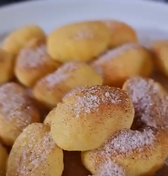

1.  **Prepare the Gnocchi:** Place the **gnocchi** in a bowl. Add one **teaspoon of extra virgin olive oil** and mix well so that all the gnocchi are lightly coated.

2.  **Cook in the Air Fryer:** Transfer the gnocchi to the air fryer basket. Cook at **190°C (375°F)** for **15 minutes**. Halfway through the cooking time (at approximately 7-8 minutes), shake the basket to ensure they cook evenly and become crispy on all sides.

3.  **Prepare the Churros Mix:** While they are cooking, in a small bowl, mix the **erythritol** or **shredded coconut** and **ground cinnamon** in the proportions you prefer (more erythritol for a sweeter flavor, more cinnamon for a spicier touch).

4.  **Serve and Coat:** Remove the hot gnocchi from the air fryer. Transfer them to the bowl with the erythritol and cinnamon mix. Toss well so they are completely coated. Serve immediately.

---

_Adaptation from [Instagram @maydenyt](https://www.instagram.com/reel/DHTEh32owRS/?utm_source=ig_web_copy_link)._

