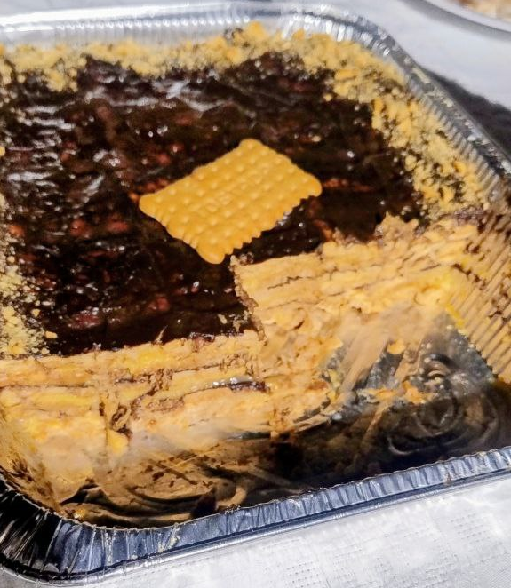

1.  **Prepare the Custard:** In a saucepan, pour 1 liter of **milk**. Set aside one glass of cold milk. Heat the rest of the milk over medium heat. In the glass of cold milk, dissolve the **2 custard mix sachets** and **sugar** to taste. When the milk in the saucepan is hot (without boiling), pour in the mixture from the glass, stirring continuously with a whisk until it thickens. Remove from heat and set aside.

2.  **Prepare the Hot Chocolate:** In another saucepan, heat the remaining **half-liter of milk** over medium heat. Add the **hot chocolate mix** and **sugar** to taste. Stir continuously with a whisk until the chocolate is completely dissolved and the mixture reaches the desired consistency. Remove from heat and set aside.

3.  **Assemble the Cake:** Choose a rectangular dish or mold. Briefly dip the **toasted cookies** in milk (you can use a little of the leftover milk if needed, without sugar) and place a first layer at the bottom of the dish.

4.  **Alternate the Layers:**
    * On top of the cookie layer, pour a layer of custard and spread it evenly.
    * Place another layer of soaked cookies.
    * On top of the cookies, pour a layer of hot chocolate and spread it.
    * Continue alternating layers of cookies with custard and chocolate until you run out of ingredients, always finishing with a layer of hot chocolate.

5.  **Chill and Decorate:** Once the cake is assembled, let it cool to room temperature and then place it in the refrigerator. Let it rest and set for at least **2 hours**, or ideally overnight. If you wish, before serving you can decorate the top with chocolate shavings or colorful sprinkles.

---

