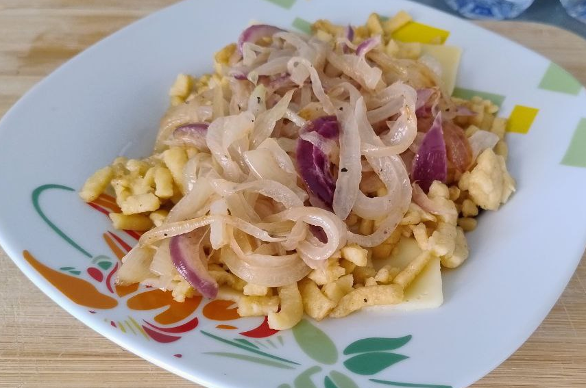

For **1 generous serving**.

1.  **Prepare the Spätzle Dough:** In a bowl, mix the **flour**, **salt**, and **nutmeg**. Add the **egg** and **milk**. Vigorously beat the mixture with a wooden spoon or hand mixer for 5 minutes. The dough should be thick and sticky, forming air bubbles. Let the dough rest for **15 minutes**.

2.  **Make the Röstzwiebeln (Crispy Onions):** Slice the **half onion** into thin rings. In a frying pan, melt half a tablespoon of **butter** over medium heat. Slowly fry the onion rings until they are **golden and crispy** (you can coat them in a little flour first for extra crunch). Remove and set aside on paper towels to drain excess fat.

3.  **Cook the Spätzle:** Bring a large pot of salted water to a boil. Using a Spätzle maker or a colander with large holes, press the dough so it drops into the boiling water. The Spätzle are ready immediately when they **float to the surface**. Quickly remove them with a slotted spoon and drain well.

4.  **Assembly and Fusion:** Melt the remaining butter in a large skillet. Add the cooked Spätzle and sauté briefly to heat them up. Reduce the heat to low. Add the mixture of **shredded cheeses** to the Spätzle and stir constantly until the cheese is completely melted and the pasta is stringy and well coated. Season with pepper.

5.  **Serve:** Serve the **Käsespätzle** immediately. Top generously with the **crispy Röstzwiebeln** and sprinkle with **fresh chives**.

_Traditionally served with a green salad or potato salad._

---

