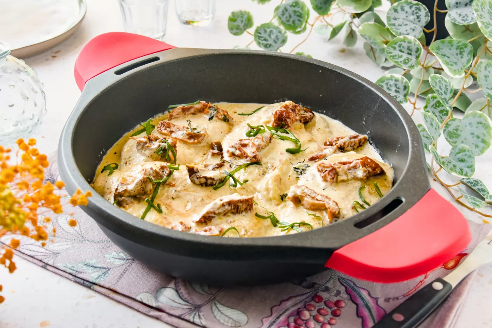

1.  **Prepare and Sear the Chicken:** Season the **chicken thighs** (or breasts) with salt and black pepper to taste. Heat 1 tablespoon of **extra virgin olive oil** in a large skillet over medium-high heat. Sear the chicken on both sides until golden brown and cooked through (approximately 6-8 minutes per side, depending on thickness). Remove the chicken from the skillet and set aside.

2.  **Prepare the Sauce Base:** In the same skillet, without cleaning it, add 1 more tablespoon of olive oil if needed. Sauté the **finely chopped onion** over medium heat for 3-4 minutes, until tender. Add the **minced garlic cloves** and sauté for 1 more minute, until fragrant.

3.  **Add Sun-Dried Tomatoes and Broth:** Stir in the **chopped sun-dried tomatoes** into the skillet. Pour in the **chicken broth** and let it simmer for 2-3 minutes, scraping the bottom of the pan to release any browned bits.

4.  **Incorporate Cream and Cheese:** Reduce the heat to medium-low. Add the **cooking cream**, **grated Parmesan cheese**, **dried oregano**, and **red pepper flakes** (if using). Stir well and simmer gently, without bringing to a rolling boil, until the sauce thickens slightly (about 5-7 minutes). Taste and adjust salt and pepper if necessary.

5.  **Return the Chicken:** Place the cooked chicken back into the skillet with the sauce. Coat it well with the sauce and let it heat through for 2-3 minutes.

6.  **Serve:** Remove the skillet from the heat. Serve the **Marry Me Chicken** immediately, garnished with a handful of **fresh chopped basil leaves** on top. It pairs wonderfully with pasta, rice, or mashed potatoes.

---

_From [Bonviveur.es](https://www.bonviveur.es/recetas/marry-me-chicken)._

