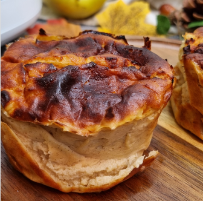

For 2 mini tarts.

1.  **Cook the Apples:** Peel and dice the **apples**. Mix them with the **cinnamon** in a microwave-safe bowl and cook for **7 minutes** at maximum power. Let them cool slightly.
2.  **Prepare the Batter:** In a blender or food processor, add the cooked apples, **eggs**, **cottage cheese**, **erythritol**, **cornstarch**, and **vanilla** (if using). Blend until the mixture is smooth and homogeneous.
3.  **Prepare the Molds:** Line two small oven or Airfryer-safe molds with parchment paper. *Tip: Make some small cuts at the corners of the paper to help it fit the shape of the mold more easily.*
4.  **Cooking (Airfryer or Oven):**
    * Pour the mixture into the molds.
    * Cover them with aluminum foil to prevent the top from burning.
    * Cook at **180°C (350°F)** for **13 minutes**.
    * Remove the foil and cook for an additional **5 minutes** until golden brown.
5.  **Cooling:** Let the tarts cool completely before unmolding so the texture sets properly.

---

_From [Instagram @menisk_s_foodies](https://www.instagram.com/reel/DFaaOI6NAG8)._

