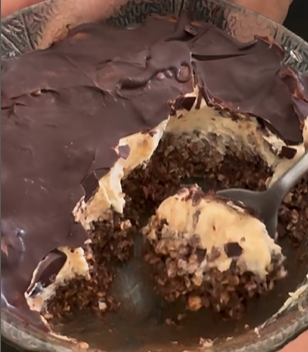

1. **Prepare the base:** In a bowl, mix the oats, cocoa powder, chia seeds, and milk.
2. **Prepare the mousse:** In a separate bowl, blend the cream cheese with the peanut butter and vanilla extract until smooth.
3. **Assemble:** Spread the mousse mixture over the oat base in the bowl.
4. **Add the topping:** Drizzle a layer of melted 85% dark chocolate on top.
5. **Chill:** Place in the freezer for 5 minutes, or refrigerate overnight for best results.

---

_From [Instagram @rochiiip_](https://www.instagram.com/reel/C7UniZrOgIp/?utm_source=ig_web_copy_link&igsh=MzRlODBiNWFlZA==)._

