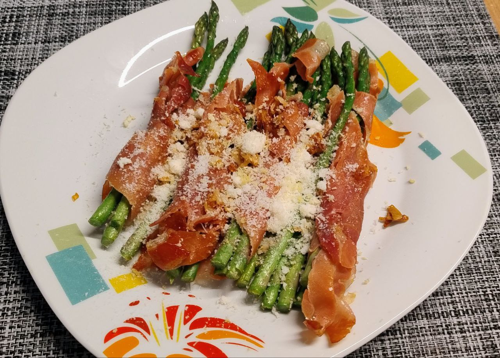

1.  **Prepare the Asparagus:** Wash the **green asparagus** and trim off the woody ends. Dry them thoroughly with paper towels.

2.  **Wrap the Asparagus:** Take a slice of **serrano ham** (or prosciutto) and wrap each asparagus spear from the base to the tip, ensuring it's held securely.

3.  **Sauté the Garlic:** Peel and finely mince the **garlic cloves**. Heat the **olive oil** in a large skillet over medium heat. Add the minced garlic and sauté for 30 seconds, being careful not to burn it.

4.  **Cook the Asparagus:** Place the wrapped asparagus in the skillet. Cook them over medium-high heat for about **6-8 minutes**, turning occasionally, until the ham is crispy and the asparagus is tender yet still has a slight crunch.

5.  **Finish and Serve:** Remove the asparagus from the skillet. Arrange them on a serving plate. Sprinkle generously with the **grated Parmesan cheese** and **lemon zest** on top. Add some freshly ground black pepper to taste. Serve immediately.

---

