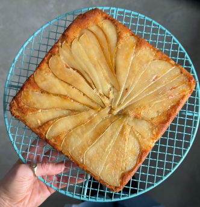

## Bottom:
1. Using 2 pears, place the pear slices along the bottom of the tin spreading them out and covering the entire bottom of the tin.

## Sponge:
1. Preheat the oven to 180°C (350°F).
2. Add the butter, sugar and vanilla extract into a bowl and combine well into a smooth paste like texture.
3. Add in the flour, baking powder, pear purée and mix into a thick smooth batter.
4. Spoon this batter over the pears into your lined tin and spread it out evenly.
5. Place in the preheated oven for 40-45 mins until golden in colour.
6. Let sit for 10-15 minutes.
7. When you're ready to turn the cake, place a board or wire rack on top of the tin using both hand securely turn the tin and wire rack 180° degrees and place onto a counter top. The tin should glide off easily and when you lift up the parchment paper the pears will be perfectly set into the cake. Revealing the crispy, golden top and edges. 

Serve with ice cream or cream custard. 

---

_Adaptation from [Instagram @rozannapurcell
](https://www.instagram.com/reel/C4SdNxeszb7/?utm_source=ig_web_copy_link)._

