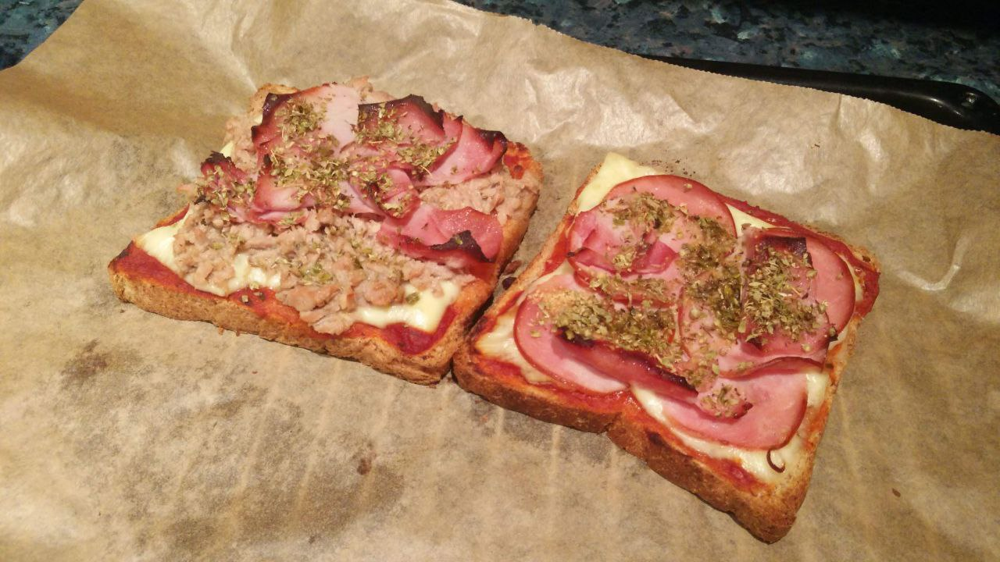

1.  **Prepare the Bread:** If you wish, lightly toast the **slices of sandwich bread** in a toaster or air fryer for 1-2 minutes. This will prevent them from getting too soggy with the toppings.

2.  **Assemble the Toast-Pizza:** On each slice of bread, spread a thin layer of **tomato sauce**.

3.  **Add the Toppings:** Place your favorite **extra toppings** over the tomato sauce.

4.  **Cover with Cheese:** Sprinkle a generous amount of **grated mozzarella cheese** over the toppings.

5.  **Bake or Cook:**
    * **In the oven:** Bake at 200°C (400°F) with the grill function on for 5-7 minutes, or until the cheese melts and turns golden.
    * **In the air fryer:** Cook at 180°C (350°F) for 5-6 minutes, or until the cheese is melted.
    * **In the microwave:** Heat for 1-2 minutes on high power. The cheese will melt but will not brown.

6.  **Serve:** Remove from the oven or air fryer and sprinkle with a little **dried oregano** on top. Serve immediately while the cheese is melted.

---

