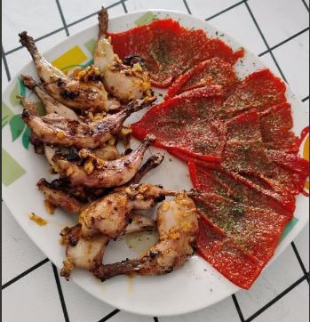

1. **Make the majao (garlic paste):** In a mortar, crush the garlic with a pinch of salt until you form a smooth paste. Optionally add the paprika and mix well.
2. **Prepare the quails:** Clean the quails and season them with salt and pepper. If you prefer, you can marinate them with the majao for an hour or two to enhance the flavor.
3. **Cook the quails:** Heat a good amount of olive oil in a large frying pan over medium heat. Once hot, brown the quails on all sides.
4. **Add the majao:** (if not marinated) Once the quails are browned, add the majao (garlic paste) to the pan, mixing it well with the quails. Let it cook for a few minutes until the flavors meld together.
5. **Deglaze the pan:** Add a splash of white wine or broth to the pan to deglaze, scraping up any bits stuck to the bottom of the pan. Let it simmer for about 10-15 minutes until the quails are cooked through and tender.
6. **Garnish and serve:** Sprinkle chopped fresh parsley on top for garnish. Serve with a side of rice, potatoes, or vegetables.

---

_Adaptation from [Cookpad](https://cookpad.com/es/recetas/16774991-codorniz-a-la-plancha-con-su-majado)_

