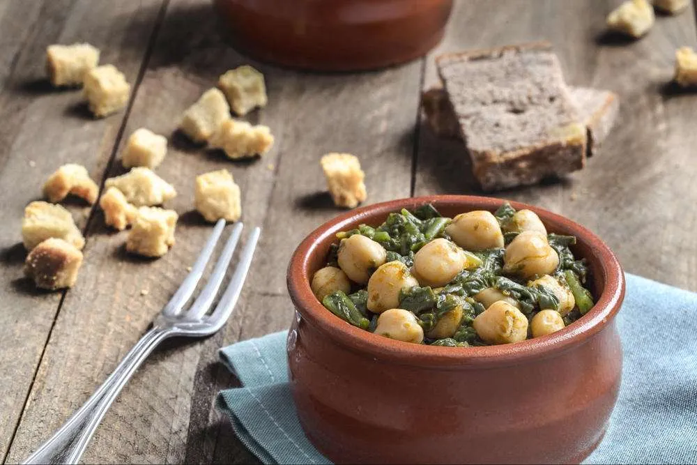

1. **Prepare the Spinach:** If using fresh spinach, wash and blanch it briefly in boiling water, then drain. If using frozen spinach, thaw and drain well.

2. **Toast the Garlic:** Heat a skillet over medium heat with olive oil. Fry the garlic cloves until golden but not burnt.

3. **Cook the Spinach and Chickpeas:** In the skillet, add a bit more olive oil if necessary. Add the spinach and chickpeas and sauté for a few minutes. Sprinkle with cumin, paprika, and vinegar (or white wine), and stir well. Add a bit of salt to taste.

4. **Serve:** Adjust salt if needed and serve warm as a side dish or as a main course with crusty bread.

---

_Adaptation from [La Despensa del Castillo](https://ladespensadelcastillo.es/blog/espinacas-con-garbanzos-sevilla/)._

