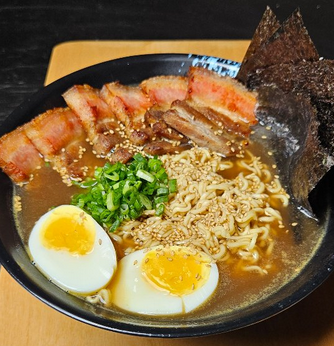

1.  **Prepare the Broth (Dashi and Bone Broth):**
    * Clean and blanch the **chicken/pork bones** in boiling water for 5 minutes to remove impurities. Rinse them and place them in a large pot with 3-4 liters of cold water.
    * Bring to a boil, then reduce the heat to a minimum. Add the **scallions**, **ginger**, and **garlic cloves**.
    * Simmer for a minimum of **3-4 hours** (the longer, the more flavor). Remove the bones and vegetables. Strain the broth to make it clear.

2.  **Prepare the Tare (Seasoning Sauce):**
    * In a small saucepan, heat the **soy sauce**, **mirin**, and **sake**. Simmer gently for 2-3 minutes to evaporate the alcohol. This is the flavor concentrate for your ramen.

3.  **Prepare the Toppings (Optional but Recommended):**
    * **Chashu:** Braise pork belly in a sweet soy sauce until very tender. Slice it thinly for serving.
    * **Ajitsuke Tamago:** Boil eggs for 6-7 minutes, peel them, and marinate them in a mixture of soy sauce, mirin, and water for at least 1-2 hours.
    * Slice the rest of the toppings, such as the **nori seaweed** into sheets, the **menma**, and the green parts of the **scallions** into thin rings.

4.  **Assemble the Ramen:**
    * Cook the **fresh ramen noodles** according to the package instructions. It's important that the rest of the dish is ready, as the noodles soften quickly.
    * Heat the broth and the tare. In a bowl, add 2-3 tablespoons of the **tare**.
    * Pour in a ladle of hot broth and mix well.
    * Add the cooked and drained noodles.
    * Arrange the toppings decoratively on top, including the **Chashu**, **Ajitsuke Tamago**, **scallions**, **nori seaweed**, and **menma**.

5.  **Serve:** Serve immediately, adding a splash of sesame oil and some **sesame seeds** to taste.

---

_Adapted from [Instagram @pisu.cocina](https://www.instagram.com/reel/DKM0SbCA9bf/)._

