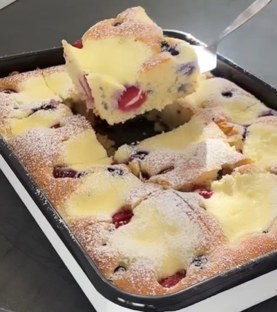

1. Mix the flour, and baking powder and set aside.
2. Beat two eggs, sugar, and vanilla for 2-3 minutes until light and fluffy. Pour in the oil and milk, then mix well. Add the flour mixture and stir until combined.
3. Grease a baking tray (30x40 cm), spread the batter evenly, and add the fruits on top.
4. In a separate bowl, mix the quark, sugar, and an egg until smooth. Use a spoon to distribute this mixture over the cake.
5. Bake the cake in a preheated oven at 180°C (350°F), top and bottom heat, for about 40 minutes. 

---

_Adaptation from [Instagram @recetasfitss](https://www.instagram.com/p/Cxbdoulvssv/?utm_source=ig_web_copy_link&igsh=MzRlODBiNWFlZA==)._

