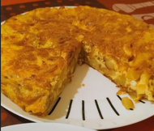

For 4 servings.

1. **Peel and slice the potatoes** into thin, even slices. If using onion, peel and finely chop it.
2. **Heat olive oil** in a frying pan over medium heat. Add the potatoes (and onion, if using) and cook gently. Stir occasionally until the potatoes are soft but not crispy (15-20 minutes).
3. Remove the potatoes (and onion) with a slotted spoon and drain excess oil.
4. **Beat the eggs** in a large bowl and season with salt. Mix in the cooked potatoes (and onion), ensuring everything is well-coated.
5. Heat a small amount of olive oil in a frying pan. **Pour the mixture** into the pan and cook over medium-low heat.
6. When the bottom is set but the top is still slightly runny, carefully flip the tortilla using a plate. Slide it back into the pan and cook until fully set (about 3-5 minutes per side).

Let the tortilla cool slightly before slicing. Serve warm or at room temperature.

---

