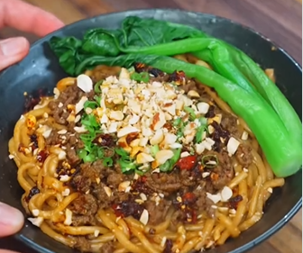

1.  **Cook the Noodles:** Cook the **noodles** until al dente. Before draining them, reserve a little of the **noodle water**.

2.  **Prepare the Sauce:** In a bowl, combine the **peanut butter**, **soy sauce**, **sugar**, **minced garlic**, **Sichuan pepper powder**, and **sriracha**. Add a splash of the reserved **noodle water** and mix well until the sauce is smooth.

3.  **Brown the Beef:** Heat a little oil in your pan. Add the **ground beef** and brown it for about 3 minutes over medium-high heat.

4.  **Finish the Beef:** Add **soy sauce**, **sugar**, and **chili oil** to the beef. Continue cooking for another 3 minutes, stirring occasionally.

5.  **Mix the Noodles:** In a large bowl, combine the cooked **noodles** with the prepared **sauce**. Mix well until the noodles are evenly coated.

6.  **Serve:** Transfer the noodles to a serving bowl and top them with the cooked **ground beef**.

7.  **Garnish and Enjoy:** Optionally, you can garnish with **steamed greens**, **scallions**, **peanuts**, and more **chili oil** to taste.

---

_From [Instagram @i.am.never.full](https://www.instagram.com/reel/DMDdukuu5rH/?utm_source=ig_web_copy_link)._

