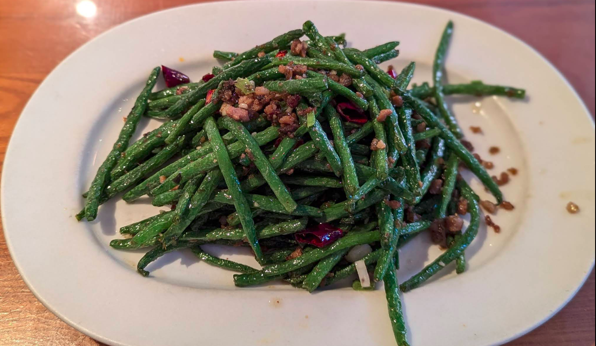

1.  **Prepare the Green Beans:** Wash the **green beans** thoroughly and snap off the ends. If they are very long, you can cut them in half or into 2-3 inch pieces. It's **crucial to dry them very well** with paper towels; this is key to ensuring they brown nicely and don't steam.

2.  **Cook the Green Beans ("Dry-Frying" Method):**
    * Heat a **wok** over medium-high heat. Add 2-3 tablespoons of **vegetable oil**.
    * Once the oil is hot (but not smoking), add the dried green beans.
    * Stir-fry the green beans constantly for **8-12 minutes**, or until their skins wrinkle, they become lightly browned, and some parts appear slightly "blistered" or bubbled. This is the most important step for achieving the desired texture. If necessary, remove a little oil if the beans become too oily.
    * Remove the green beans from the wok and set them aside on a plate.

3.  **Sauté the Aromatics:**
    * If there's a lot of oil left in the wok, drain some off, leaving about one tablespoon.
    * Add the minced **garlic**, minced **ginger**, whole **dried red chilies**, and **Sichuan peppercorns** (if using).
    * Stir-fry over medium-high heat for **30 seconds to 1 minute**, until the chilies are fragrant and the Sichuan peppercorns begin to release their aroma. Be careful not to burn the garlic.

4.  **Finish the Dish:**
    * Return the green beans to the wok.
    * Add the **light soy sauce**, **sugar**, and **salt**. Quickly stir-fry to combine all ingredients and coat the green beans with the sauce.
    * If using, add the **Chinese black vinegar** and **toasted sesame oil**. Mix well.
    * Taste and adjust seasoning as needed.

5.  **Serve:**
    * Serve the Stir-fried French Beans with Dry Chili immediately, ideally with steamed white rice.

---
**Key Tips:**
* **Drying:** Do not underestimate the importance of thoroughly drying the green beans.
* **Hot Wok:** Use a well-heated wok or large pan over high heat for proper stir-frying.
* **Spice Level:** Adjust the amount of dried chilies to your preference.
* **Sichuan Peppercorns:** For an authentic Sichuan experience, don't skip the Sichuan peppercorns; they provide the characteristic "mala" (numbing and spicy) flavor.

---

_Adapted from[M&L Szechuan Chinese @Dublin, Ireland](https://mlchineserestaurant.com/)._

