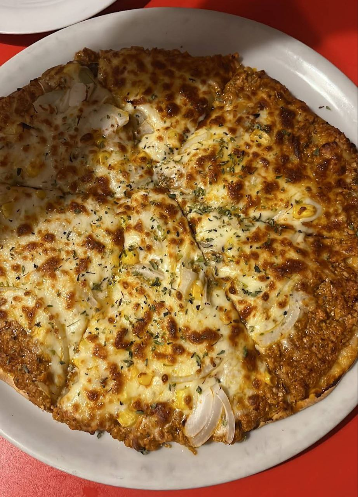

1. **Preheat the oven:** Preheat to 220°C (430°F) or follow the pizza dough package instructions. Place a pizza stone or baking sheet in the oven to heat up.
2. **Prepare the base:** Roll out the pizza dough to your desired thickness and place it on a sheet of parchment paper for easy handling. Spread an even layer of tomato sauce over the dough.
3. **Add toppings:** Sprinkle the shredded mozzarella cheese evenly over the base. Distribute the cooked ground beef, sweet corn, onion slices, and jalapeño slices (if adding before baking) over the cheese.
4. **Add extra cheese:** Sprinkle the additional cheese on top for an indulgent layer.
5. **Bake:** Carefully transfer the pizza (on the parchment paper) onto the preheated pizza stone or baking sheet. Bake for 10-12 minutes, or until the crust is golden and the cheese is bubbly and slightly browned.
6. **Serve:** Remove from the oven, slice, and serve hot. If you prefer, add fresh jalapeño slices or hot sauce after baking for a spicier touch.

---

_From [Pizzería Marta's (old Pizzería Mejicana)](https://pizzeriamarta.es/)._

