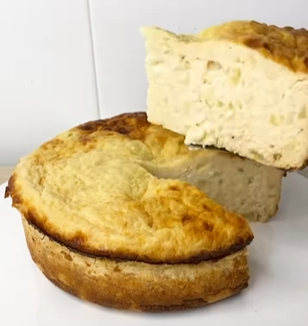

1. **Mash the bananas:** In a bowl, mash the bananas until smooth.
2. **Mix ingredients:** Add the yogurt, eggs, and sweetener or vanilla extract. Mix until well combined.
3. **Preheat the oven or Air-Fryer:** Preheat your oven to 180°C (350°F).
4. **Prepare the pan:** Grease a cake pan or line it with parchment paper.
5. **Pour the mixture:** Pour the batter into the prepared pan and smooth the top.
6. **Bake:** Bake in the oven for 50 minutes, or until a toothpick inserted into the center comes out clean.

---

_Other versions:_
- _[Instagram @equilibrio.saludable1](https://www.instagram.com/reel/DBH01e6uV5M/?utm_source=ig_web_copy_link&igsh=MzRlODBiNWFlZA==)_
- _[Instagram @_recetas_sanasyricas](https://www.instagram.com/p/CeGeb3lpA48/?utm_source=ig_web_copy_link)_
- _[Instagram @sanatentacion.mf](https://www.instagram.com/reel/C9IMK8tMQqn/?utm_source=ig_web_copy_link)_

