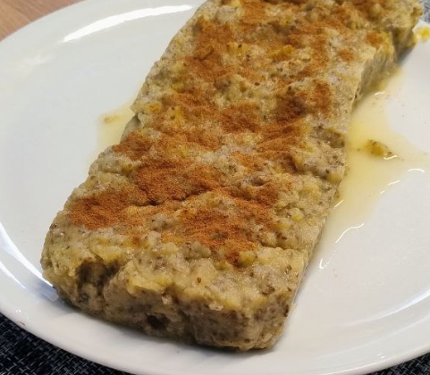

Para 4 raciones.

1.  **Preparar las manzanas:** Lava bien las **4 manzanas** (sin pelar) y córtalas en cubos pequeños.
2.  **Cocer las manzanas:** En una sartén u olla, derrite la **mantequilla** a fuego medio. Añade las manzanas cortadas y la **canela**. Cocina, revolviendo ocasionalmente, hasta que las manzanas se ablanden y empiecen a deshacerse, formando una compota gruesa (aproximadamente 10-15 minutos). Si lo deseas, añade el edulcorante o azúcar en este paso.
3.  **Hidratar la gelatina:** Mientras las manzanas se cocinan, pon las **4 hojas de gelatina** en un bol con agua fría durante unos 5 minutos, hasta que estén blandas.
4.  **Añadir Chía y Vainilla:** Retira la sartén del fuego. Incorpora las **semillas de chía** y la **esencia de vainilla**. Remueve bien para distribuir la chía de manera uniforme. El calor residual de la compota ayudará a que la chía empiece a gelificar.
5.  **Disolver la gelatina:** Escurre las hojas de gelatina hidratadas y añádelas a la compota caliente (fuera del fuego). Remueve vigorosamente hasta que se disuelvan por completo.
6.  **Montaje y reposo:** Vierte la mezcla en un molde pequeño (idealmente de silicona o cubierto con film para facilitar el desmolde). Alísala con una cuchara.
7.  **Enfriar:** Refrigera por un mínimo de **4 horas** o hasta que el pastel haya cuajado por completo y esté firme.

---

_Adaptación de [Cocina Fácil](https://www.lecturas.com/recetas/postre-manzana-sin-horno-2-ingredientes_19649.html)._

