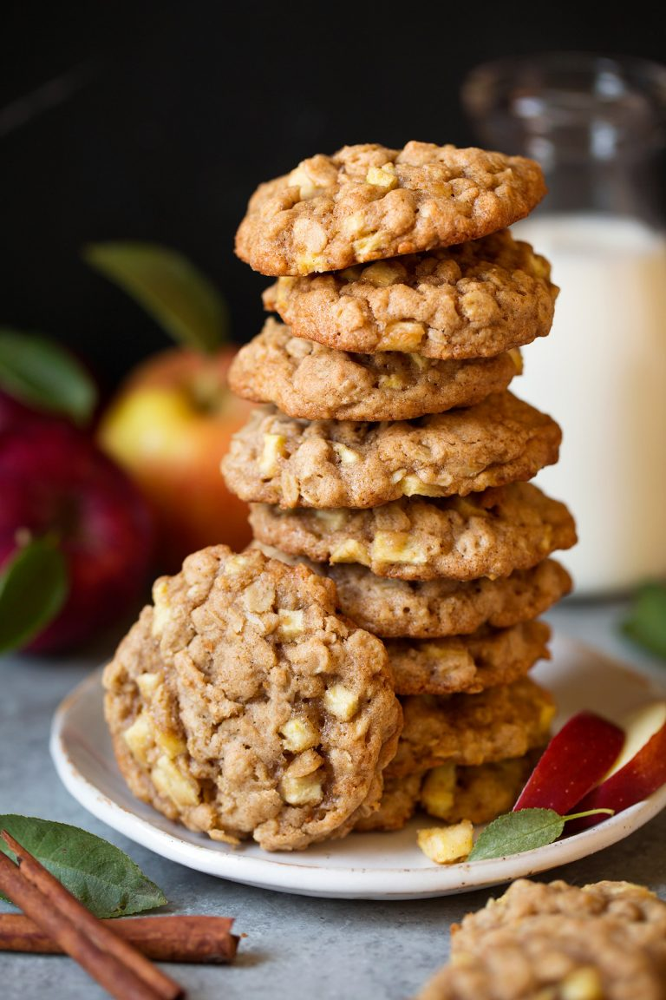

1. Peel and chop finely the apples (0.5 cm cubes or smaller).
2. Preheat oven to 180°C (350°F) degrees. Line two 45x30 cm baking sheets with silicone baking mats or parchment paper. 
3. In a mixing bowl whisk together flour, oats, cinnamon, baking soda and salt for 20 seconds, set aside.
4. In the bowl of an electric stand mixer fitted with the paddle attachment cream together butter and brown sugar until combined. Mix in egg and vanilla extract.
5. Toss apples with lemon juice in a small bowl. Add flour mixture to egg and vanilla mixture and mix until combined, then mix in apples. 
6. Scoop dough out using a medium cookie scoop, or 2 Tbsp at a time, and drop onto prepared baking sheets spacing cookies 2-inches apart. Flatten them just slightly.
7. Bake one sheet at a time in preheated oven until cookies are set, about 14 - 15 minutes. 
8. Let cool on baking sheet several minutes then transfer to a wire rack to cool completely. Store cookies in an airtight container.

---

_From [Cooking Classy](https://www.cookingclassy.com/apple-cinnamon-oatmeal-cookies/)._

