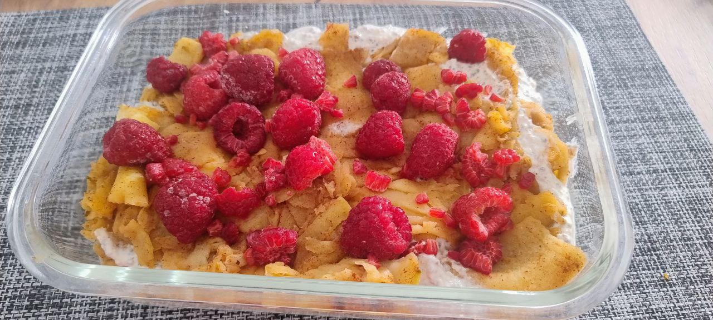

1. Pela y lamina muy finamente las manzanas verdes.
2. Saltéalas en una sartén con la mantequilla, el jengibre y la canela durante 8–10 minutos, removiendo ocasionalmente.
3. En un bol, mezcla el queso fresco batido con la esencia de vainilla, las semillas de chía trituradas y los copos de avena.
4. En un recipiente de cristal, alterna capas de manzana caliente con la mezcla de queso.
5. Decora con frambuesas congeladas por encima y sirve frío o templado.

