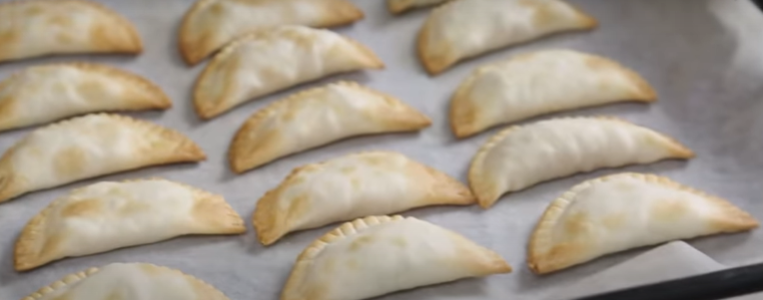

1. Precalienta el horno a 200 °C (390 °F).
2. Pela las manzanas, córtalas en cubitos pequeños y saltéalas en una sartén a fuego medio durante 15 minutos, removiendo de vez en cuando con el azúcar (opcional) y la mantequilla hasta que se caramelicen ligeramente. Añade la canela y mezcla. Deja enfriar.
3. Rellena las obleas con la mezcla de manzana y dóblalas, sellando los bordes con ayuda de un tenedor.
4. Coloca las empanadillas en una bandeja de horno y, opcionalmente, pincélalas con un poco de aceite de girasol o huevo utilizando un pincel de cocina.
5. Hornea durante 10–12 minutos hasta que estén ligeramente doradas.
6. Una vez frías, espolvorea con azúcar glas (opcional).

---

_Adaptación de [Nestlé Cocina](https://www.nestlecocina.es/receta/empanadillas-de-manzana-con-canela)._

