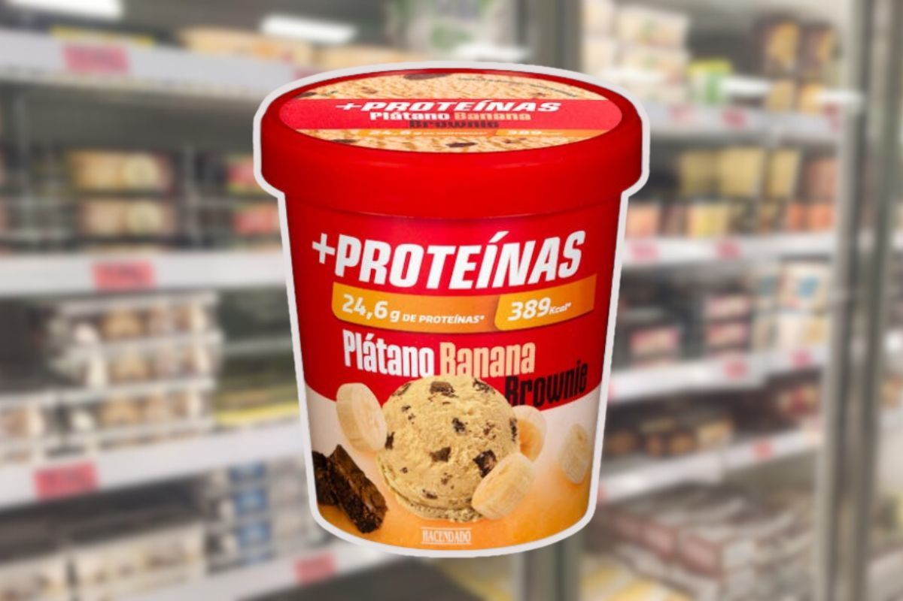

1. Tritura los plátanos con el yogur y la mantequilla de cacahuete en una batidora.
2. Coloca la mezcla en el congelador durante 30 minutos.
3. Sirve y añade los trocitos de chocolate picado.

---

_Adaptación de [Instagram @miguelnaarfit](https://www.instagram.com/reel/C8Fg_5NCNkG/?utm_source=ig_web_copy_link&igsh=MzRlODBiNWFlZA==)._

