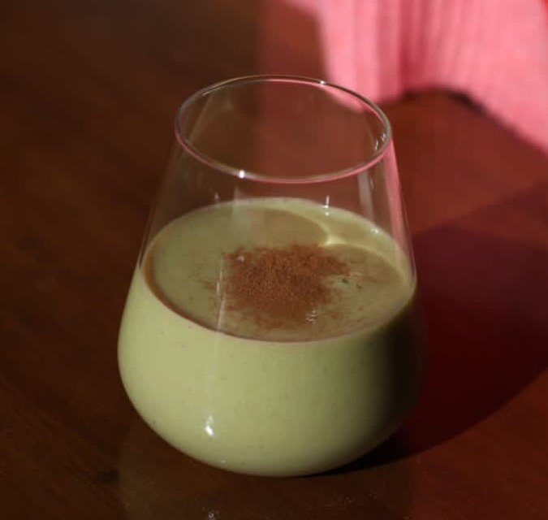

1 ración.

1. Corta, pela y deshuesa el aguacate. Se recomienda partirlo por la mitad y extraer la pulpa con una cuchara grande.
2. Trocea el aguacate y colócalo en el recipiente donde lo vayas a batir.
3. Añade la leche, el edulcorante y la canela. Si quieres probarlo con plátano, este es el momento de añadirlo también.
4. Bate todo junto (con cuidado para que no salpique).

## Consejos:
- Si queda muy espeso o muy líquido, puedes ajustar añadiendo más leche o más aguacate.
- Se recomienda usar leche fría para que el baticate sea más refrescante.
- Opcionalmente, puedes añadir un plátano para darle un toque muy sabroso.

---

_Adaptación de [Crowd Farming](https://www.crowdfarming.com/blog/en/the-baticate-from-malaga/)._

