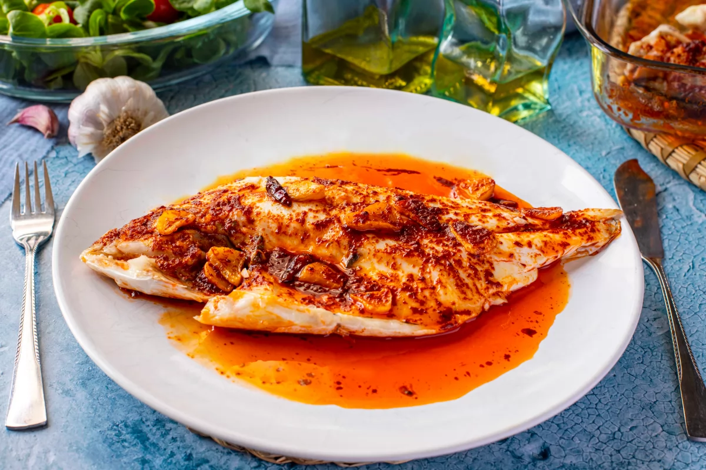

1. **Precalentar el horno:** Precalentar a 200°C (390°F). Coloca la dorada en una fuente de horno y hornea durante 15 minutos.
2. **Preparar el aceite de ajo y guindilla:** Mientras se hornea el pescado, calienta el aceite de oliva en una sartén a fuego medio. Añade las láminas de ajo y las guindillas cayenas, y cocina hasta que el ajo se ponga dorado. Retira del fuego.
3. **Finalizar la salsa:** Saca la dorada del horno y vierte la mezcla de aceite con ajo y guindilla por encima.
4. **Extraer los jugos:** Inclina o sacude suavemente la fuente de horno para mezclar los jugos naturales del pescado con el aceite. Vierte los jugos de vuelta en la sartén.
5. **Completar la salsa con pimentón:** Calienta la sartén con los jugos hasta que hierva, luego retíralo del fuego. Añade el pimentón dulce y mezcla bien. Vierte la salsa sobre el pescado.
6. **Servir:** Sirve medio pescado por persona.

## Consejos
- Acompaña este plato con patatas asadas, verduras al vapor o pan crujiente para absorber la sabrosa salsa.
- Ajusta las guindillas cayenas según tu tolerancia al picante.
- El pescado también puede cocinarse en la sartén, lo cual es más rápido y igualmente sabroso, ideal cuando no quieras usar el horno.
- Ten cuidado de no sobrecocinar el ajo ni el pimentón para evitar que se amarguen.

---

_Adaptación de [Bon Viveur](https://www.bonviveur.es/recetas/dorada-a-la-bilbaina)._

