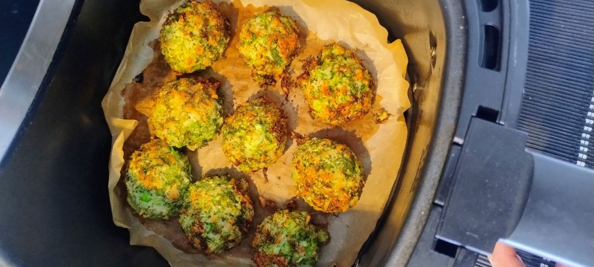

1. **Preparar el brócoli:**  
Pica finamente el brócoli crudo (ramilletes y tallos si se desea) con un cuchillo o tritúralo en un procesador de alimentos hasta que tenga una textura similar a migas gruesas. Este método conserva todos los nutrientes y la textura del brócoli fresco.

2. **Mezclar los ingredientes:**  
En un bol grande, mezcla el brócoli picado con el queso rallado, el pan rallado y los huevos. Remueve hasta obtener una masa uniforme.

3. **Formar las albóndigas:**  
Con las manos limpias, forma bolitas del mismo tamaño. Deberías obtener entre 12 y 15, según su tamaño.

4. **Cocinar las albóndigas:**  
**En freidora de aire:** Coloca las albóndigas en la airfryer a 195 °C durante 12 minutos.  
**En horno:** Precalienta el horno a 200 °C y hornea las albóndigas durante 15 minutos, o hasta que estén doradas y ligeramente crujientes.

1. **Servir:**  
Sirve calientes como aperitivo, snack o comida ligera. Combinan muy bien con una salsa de yogur, hummus o salsa de tomate.

## Notas:
- Puedes usar pan rallado sin gluten para una versión completamente sin gluten.  
- El queso sin lactosa, como el de la marca Kaiku, funciona muy bien si tienes intolerancia.  
- Añade una pizca de ajo en polvo o perejil para potenciar el sabor.

---

_From [Instagram @kaikusinlactosa](https://www.instagram.com/p/DG5Wba2ANUM/?utm_source=ig_web_copy_link&igsh=MzRlODBiNWFlZA==)._

