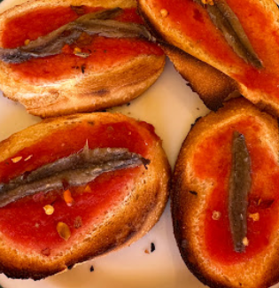

1. Unta el tomate sobre las rebanadas de pan.
2. Añade el aceite picante.
3. Coloca una o dos anchoas por rebanada de pan.
4. Colócalos en el horno a 180°C (350°F) durante 5 minutos (o hasta que el pan esté ligeramente tostado).
---

_From [Pizzería Papa Luigi](https://maps.app.goo.gl/wTpAwbJGC6yX76Vn9)._

