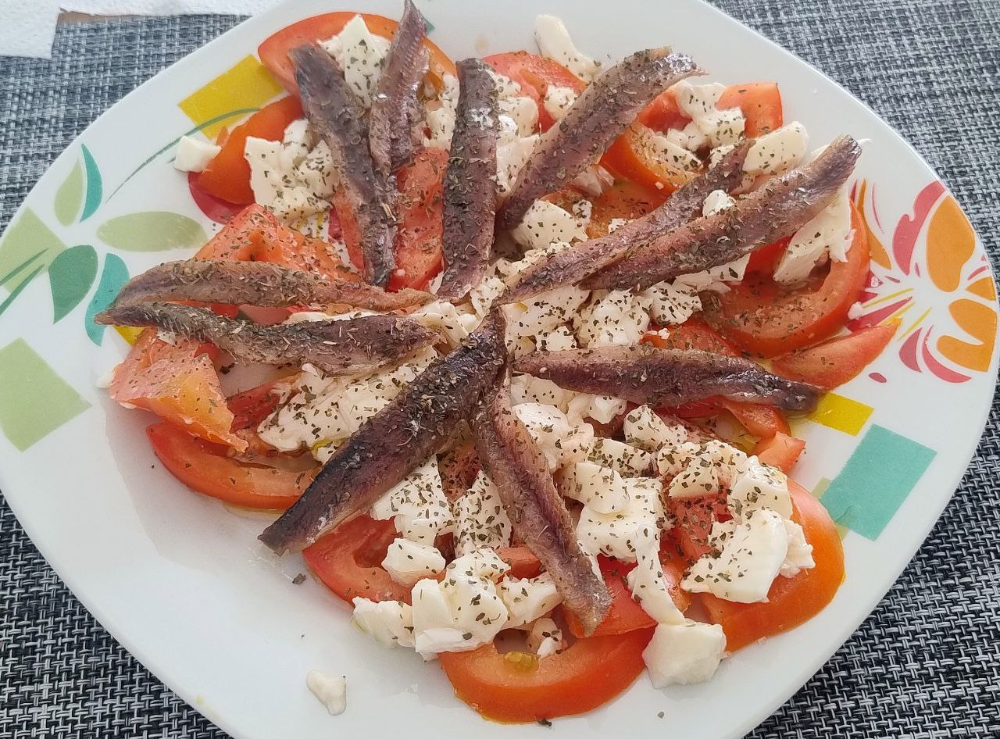

1.  **Prepara los tomates:** Lava los **tomates** y córtalos en rodajas de grosor medio. Distribúyelas de forma decorativa en la base de un plato grande o de una fuente para servir.

2.  **Añade la burrata:** Abre la **burrata** con las manos, rasgándola en trozos irregulares, o córtala delicadamente. Colócala sobre las rodajas de tomate, distribuyéndola de manera uniforme.

3.  **Coloca las anchoas:** Escurre ligeramente los **filetes de anchoa** del aceite y distribúyelos sobre la burrata y el tomate. Puedes colocarlos en un patrón radial o simplemente esparcirlos.

4.  **Aliña:** Rocía generosamente toda la ensalada con el **Aceite de Oliva Virgen Extra (AOVE)**. La calidad del aceite es clave para este plato.

5.  **Sazona y decora:** Espolvorea **sal marina en escamas** al gusto. Finaliza añadiendo las **hojas de albahaca fresca** (enteras o ligeramente rasgadas). Si lo deseas y como se aprecia a veces en la imagen, espolvorea un poco de **orégano seco** y/o pimienta negra recién molida para un toque aromático adicional.

6.  **Sirve:** Sirve la ensalada inmediatamente para disfrutar de la frescura y el contraste de sabores de todos los ingredientes.

---

