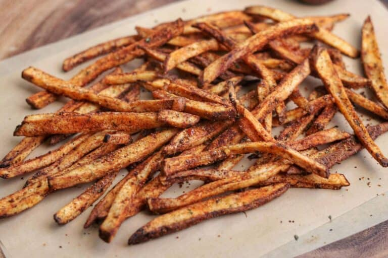

1. **Preparar las papas:** Lava, seca y corta la papa en tiras de 1/4". Mézclalas con aceite de maní hasta que estén bien cubiertas.
2. **Freír al aire:** Cocina en una freidora de aire a 200°C (400°F) durante 15 minutos hasta que estén doradas.
3. **Mezcla de especias:** Mezcla todos los ingredientes restantes para crear una mezcla de condimentos cajún.
4. **Mezclar con las especias:** Mezcla las papas con 1/2 a 3/4 de la mezcla de especias. Vuelve a ponerlas en la freidora de aire durante 4-6 minutos a 200°C (400°F).
5. **Toque final:** Espolvorea el resto de la mezcla de especias y sirve caliente.

Esta receta es una versión más saludable de las famosas Papas Fritas Cajún de [Five Guys](https://www.fiveguys.com/).

---

_From [Kinda Healthy Recipes](https://masonfit.com/copycat-five-guys-cajun-fries/)._

