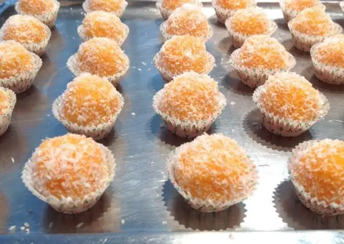

1. Cut the carrots into slices and boil them with a little water for about 20 minutes until they are soft. Drain them well and let them cool.
2. Once they are cool, mash them well with a fork until you get a thick purée. 
3. In a bowl, mix the mashed carrots with the shredded coconut until you get a smooth mixture.
4. Crumble magdalenas or sponge cake into the mixture, enough to give the dough some consistency so it can be formed into balls.
5. Form small balls with your hands.
6. Roll the balls in shredded coconut to coat them.
7. Refrigerate for a couple of hours before serving.

---

_Adaptation from [Cookpad](https://cookpad.com/es/recetas/129459-bolitas-de-coco-rallado-y-zanahoria)._

