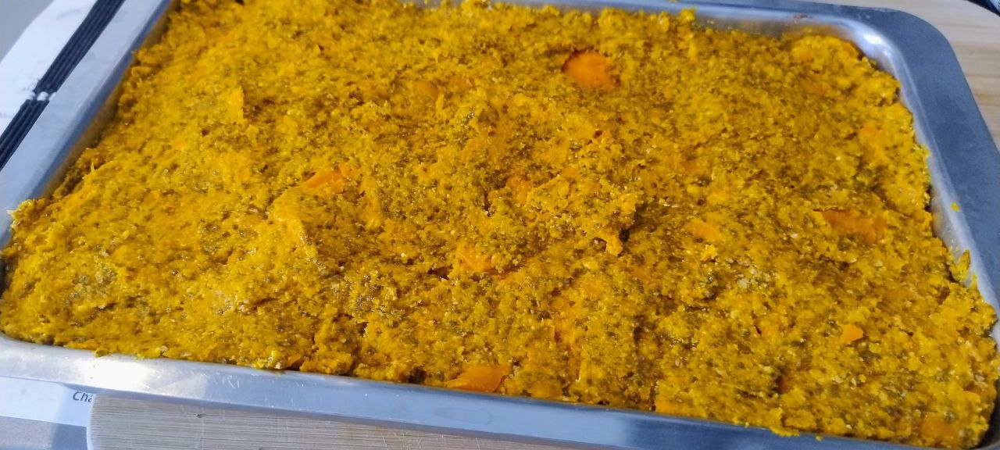

1. Corta las zanahorias en rodajas y hiérvelas con un poco de agua durante unos 15 minutos hasta que estén blandas. Escúrrelas bien y déjalas enfriar.  
2. Tritura las galletas hasta hacerlas polvo. Mézclalas con la mantequilla derretida y el cacao en polvo hasta formar una masa.  
3. Forra el fondo de una bandeja o molde rectangular con esta mezcla, presionando bien para que quede compacta. Reserva en la nevera.  
4. Una vez frías las zanahorias, aplástalas con un tenedor o tritúralas con una batidora hasta obtener un puré espeso.  
5. Incorpora al puré la esencia de vainilla, las semillas de chía y el coco rallado (si se desea). Mezcla bien.  
6. Añade la harina de avena poco a poco hasta conseguir una mezcla firme y moldeable.  
7. Extiende esta masa sobre la base de galleta, alisando bien la superficie.  
8. Refrigera durante al menos un par de horas antes de servir. Puedes espolvorear coco rallado o azúcar glass por encima para decorar.

---

Esta receta es similar a las [**Bolitas de zanahoria y coco**]().

