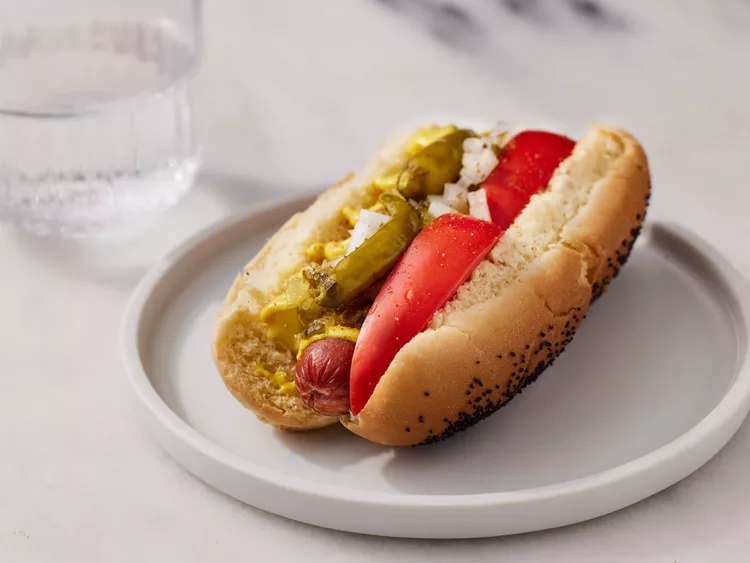

Quantities for 1 serving.

1. **Prepare the hot dogs:** Steam or boil the hot dogs according to package instructions. If you prefer a grilled flavor, you can grill them until heated through.
2. **Prepare the buns:** Steam the poppy seed buns for a few minutes until soft and warm. You can use a steamer or wrap them in a damp paper towel and microwave them briefly.
3. **Assemble the hot dogs:** Place each hot dog into a steamed poppy seed bun.
4. **Add the toppings:**
- Add yellow mustard along the length of the hot dog.
- Spoon sweet green pickle relish on top.
- Sprinkle the finely chopped onions over the relish.
- Place a pickle spear on one side of the hot dog, tucking it into the bun.
- Arrange two tomato wedges on the opposite side of the pickle spear.
- Add a sport pepper or two on top, if desired.
- Sprinkle with celery salt for the final touch.

---

_Adaptation from [allrecipes](https://www.allrecipes.com/recipe/134483/chicago-style-hot-dog/)._

