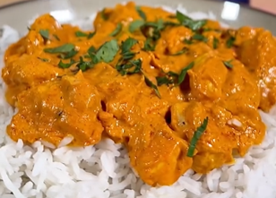

1. Cocina el arroz.
2. Corta la pechuga de pollo en trozos y saltéala con sal y pimienta.
3. Añade el queso crema, el yogur griego y un poco de pasta de tomate, y mezcla bien.
4. Agrega el pimentón dulce o picante, ajo y cebolla en polvo, una cantidad generosa de curry, una pizca de comino y colorante alimentario (opcional).
5. Mezcla hasta que reduzca ligeramente.

---

_De [Instagram @ugar90](https://www.instagram.com/reel/C0yqhV9qyYX/?utm_source=ig_web_copy_link&igsh=MzRlODBiNWFlZA==)._

