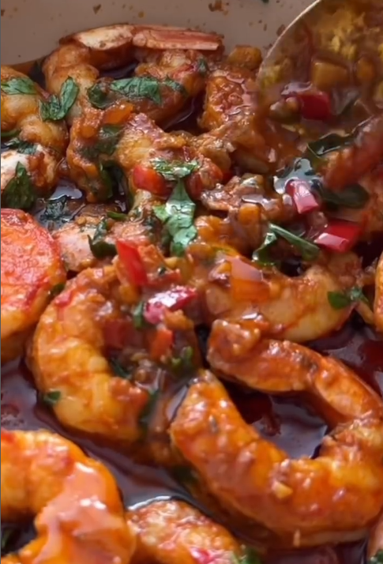

1. **Prepara las gambas:**  
Si no lo están ya, lava, pela y desvena las gambas.

2. **Cocina los aromáticos:**  
En una sartén a fuego medio, añade la mantequilla y el aceite de oliva. Cuando estén calientes, añade el ajo, la cebolla roja picada y la guindilla. Sofríe durante unos 2 minutos hasta que suelten aroma.

3. **Añade las especias y el limón:**  
Agrega el pimentón ahumado y el condimento de chile y limón. Cocina 2 minutos más. Añade la ralladura y el zumo de medio limón y remueve bien.

4. **Cocina las gambas:**  
Incorpora las gambas a la sartén y cocínalas unos 2 minutos por cada lado, hasta que estén rosadas y bien hechas.

5. **Decora y sirve:**  
Retira del fuego, añade abundante perejil fresco picado y remueve suavemente. Sirve caliente con pan crujiente, pasta o arroz.

## Notas:
- Ajusta la cantidad de guindilla según tu tolerancia al picante.
- Para una versión sin lácteos, sustituye la mantequilla por más aceite de oliva.
- Estas gambas también son perfectas como relleno para tacos.

---

_From [Instagram @thecurrycountess](https://www.instagram.com/reel/DGf7wHPIdmH/?utm_source=ig_web_copy_link&igsh=MWx5cmlxaXc5Z2F3eA==)._

